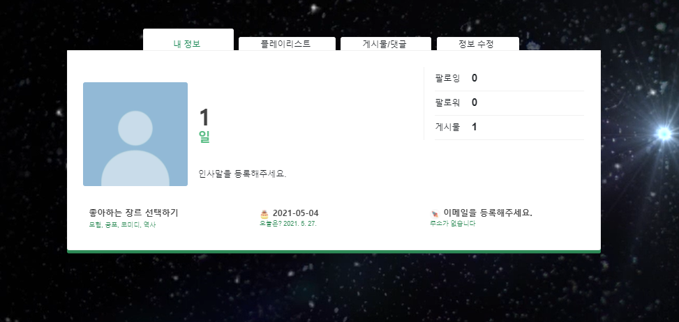

### i. 팀원 정보 및 업무 분담 내역 

#### 안기훈 (Django 20% Vue 80%)

>Django
>
>* models.py 구성
>
>* accounts(update, delete)
>
>* movie search 등
>
>
>
>Vue
>
>* Home 화면 구성
>* 내 정보 페이지 구성
>* 커뮤니티(게시물, 댓글 확인/작성/수정/삭제)
>
>* navbar
>* articles 기능
>* login/signup

#### 김혜인 (Django 80% Vue 20%)

> ##### Django
>
> * models.py 구성
>
> - movies.json, genres.json파일 (tmdb popular api기반으로 100개 추출)
>
> - movies, accounts, community의 코드 구현
>
> - 유저간 팔로우, 팔로잉 기능 구현
> - movie 좋아요 기능 구현
>
> - 유저가 좋아하는 장르 추가 삭제 구현
> - 추천 서버 구현
> - 홈화면 best movie
>
> ##### Vue
>
> - 영화 상세 정보 페이지 MovieDetail.vue
> - 영화 추천 페이지 (랜덤 추천, 장르별 추천)
> - 팔로우 팔로잉 구현 조금함

### ii. 목표 서비스 구현 및 실제 구현 정도

#### 개발 일정

#### 기능별 목표 구현 사항

#### 목표 서비스 목록

#### 서비스 실제 구현 상황

### iii. 데이터베이스 모델링(ERD) 

### iv. 필수 기능에 대한 설명 

#### 영화 정보

TMDB의 Popular movies API를 이용해 100개의 영화 정보를 홈화면에 보여준다. 그리고 이 중 평점이 높은 영화 20개를 골라 Best Movies에 보여준다. 해당 영화를 클릭하면 상세페이지로 넘어간다. 

상세페이지에서는 영화 아이디를 바탕으로 유튜브의 예고편 비디오를 보여준다. 그리고 TMDB의 similar movies API를 이용해 해당 영화의 유사 영화들 중 3개를 우측에 보여준다. 
영화의 발매일과 줄거리, 어떤 장르인지를 비슷한 영화 추천 밑에 보여준다.

영화에 대한 별점과 리뷰를 한줄평으로 남길 수 있다. 이때 내가 작성한 리뷰일 경우 수정과 삭제가 가능하다. pagination으로 리뷰들을 넘겨볼 수 있게 구성하였다. 

#### 추천 알고리즘

추천알고리즘은 랜덤 추천과 좋아하는 장르별 추천으로 나뉜다. 랜덤 추천은 전체 영화 중 무작위로 10개를 보여준다.

장르별 추천의 경우 아래와 같이 내 프로필에서 좋아하는 장르를 선택하게 되면, 해당 장르의 영화들을 보여준다.

이때 좋아하는 장르를 바꿀 때마다 추천도 이에 맞춰서 장르에 대한 영화를 보여준다. 

#### 커뮤니티

커뮤니티에서는 게시글, 댓글 생성 및 수정, 삭제가 가능하다. 

아래는 게시글 디테일 페이지이다. 

위처럼 게시글에 대한 댓글을 여러개 작성 가능하며 각각 수정과 삭제가 가능하다.

#### 프로필

프로필에서는 다른 사람을 팔로우 가능하며, 좋아하는 장르 선택과 정보 수정이 가능하다.

프로필에서 플레이리스트를 생성하고 영화 페이지에서 영화를 플레이리스트에 담아, 나만의 플레이리스트를 만들 수 있다.

게시글 / 댓글 모아보기 기능은 구현단계이다. 

### vi. 기타(느낀점)

#### 혜인

최종 프로젝트를 처음 시작할 때는 vue와 django를 같이 하는 것이 어색해 하나의 기능을 구현하는 데에 오래걸렸다. 하지만 매일 디버깅하는 과정과 기능 구현에 대한 고민의 시간을 거치고 나니 조금씩 나아지고 있음을 느낄 수 있었다. 지금까지 배워왔던 이론적인 내용들을 다시금 복습할 수 있는 좋은 시간이었으며, 팀원과 함께 하나의 사이트를 만들어본 것이 뿌듯하게 느껴졌다. 

#### 기훈

​	얼마 배우지 않은 vue로 화면을 전부 구성하는 부분이 가장 어려웠습니다. 검색해서 찾아야 하는 것도 많았고, json으로 데이터를 가져오기 때문에 Django로 작업하던 것과 달라 헷갈리는 것도 많았습니다. 그래도 하나씩 만들어 갈수록 조금씩 익숙해지는 것이 느껴졌고, 다음에 다른 것을 만들 때 도움이 될 것 같은 부분이 많아서 재미있었습니다. 골고루 경험해보기 위해 FRONT와 BACK으로 나눴지만 조금씩 지분을 나눠 작업해서 데이터 전달에 대한 전반적인 이해도를 키웠습니다.

​	프로젝트가 제 수명을 갉아먹는 것 같지만 재밌어서 버틸 수 있었던 것 같습니다!